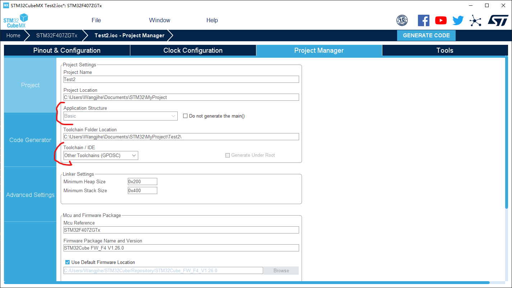
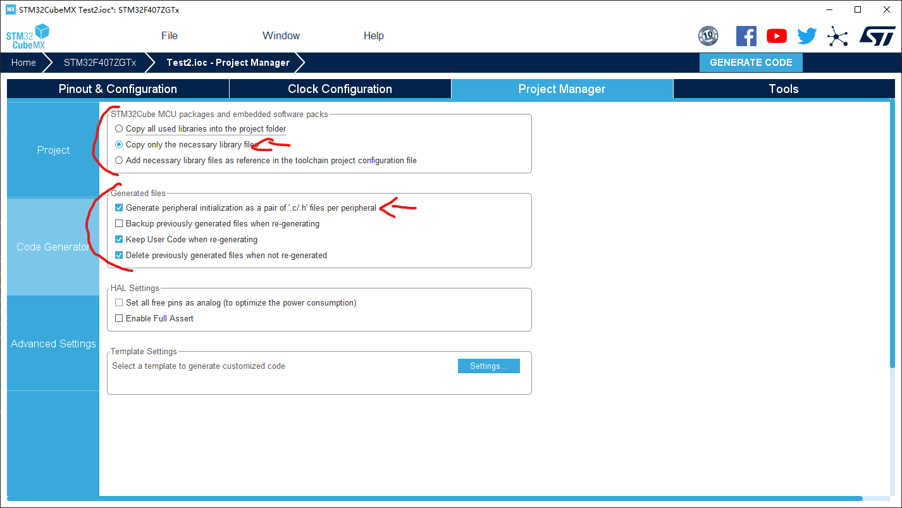
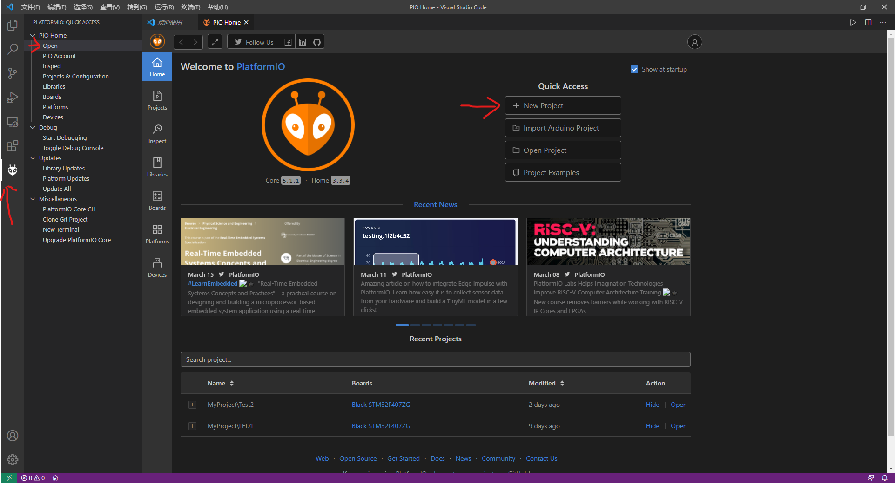
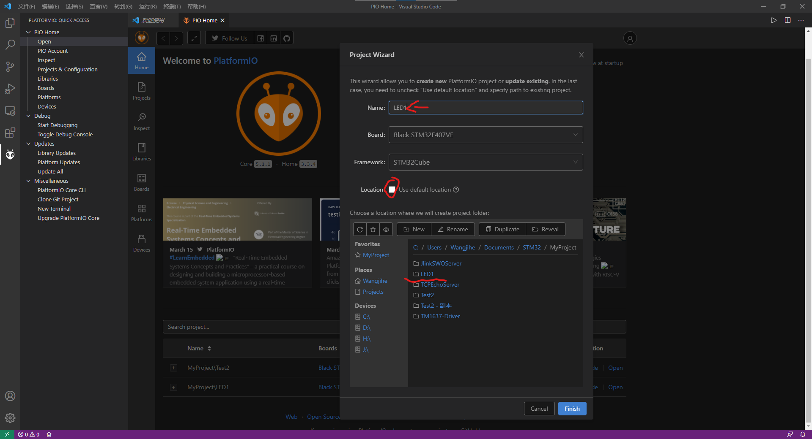
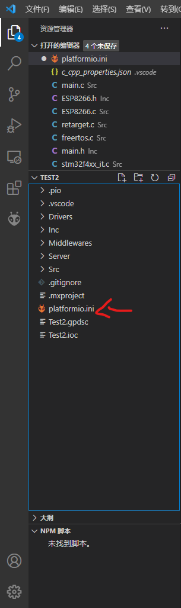
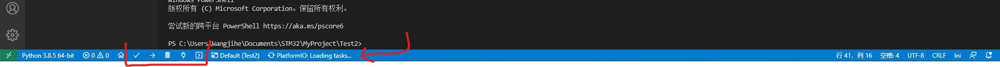
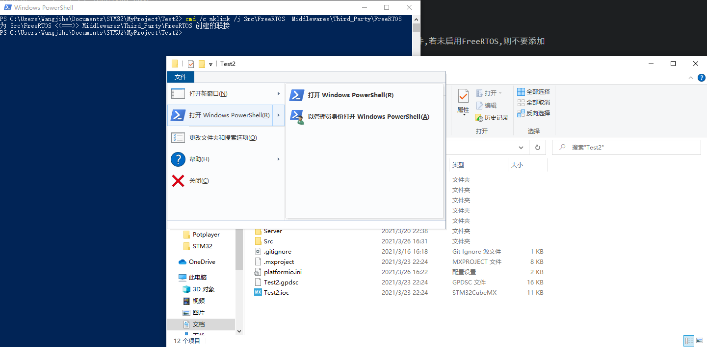
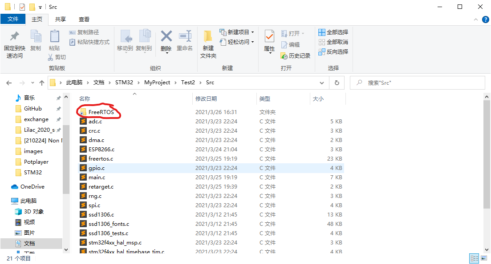
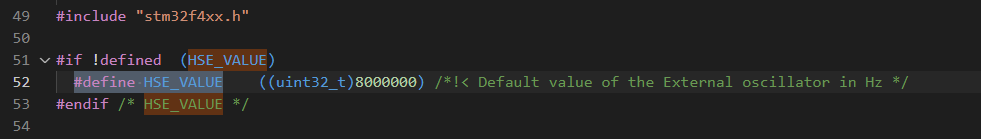

## vscode + platformIO + STM32CubeMX + FreeRTOS 配置 ##

注意,本为基于STM32F4系列,若你使用的芯片有所不同,请视情况自行修改部分内容  

#### STM32CubeMX ####
主要要注意的是Project Manager下的配置(请务必在第一次Generate Code之前修改):  
1. Project下 Application Structure 选择`Basic` (将不会生成额外一层Core文件夹)  
2. Project下 Toochain/IDE 选择 `Other Toochains (GPDSC)` (适配PlatformIO)  
3. Code Generator下 第一框,选择 `Copy only the necessary library files` (只复制使用到的文件)  
4. Code Generator下 第二框,勾选 `Generate peripheral initialization as a pair of '.c/.h' files per peripheral` (将.c/.h分开放置在Src/Inc)  
  
  

#### platformIO ####
先在vscode安装该插件,等待其下载必要组件,并遵循右小角提示重启vscode,安装完毕后会看到vscode左边栏出现「蚂蚁头」  
点击后选择Open,等待右边页面加载(首次可能需要联网,比较慢),然后点击`+New Project`  
  
`Name`字段需要和STM32CubeMX中的`Project Name`相同, Board则选取你正在使用的芯片, Framework选择`STM32Cube`  
然后取消勾选`Use default location`, 并选择你项目所在的父目录(即在该目录下能看到你项目对应的文件夹), Finish后等待必要组件下载  
  
接下来就是配置platformIO项目  
在vscode文件树下找到`platformio.ini`, 修改为下方内容(`;`后内容为注释,无需删除)  
  
```ini
[env:black_f4xxxx]

platform = ststm32
board = black_f4xxxx   ; 板子型号,生成的platformio.ini默认包含,无需修改,包括上方的env:black_f4xxxx
framework = stm32cube  ; 使用的框架,也是生成好的,无需修改

build_flags =                                        ; 传递给编译器gcc的参数
    -ISrc/FreeRTOS/Source/CMSIS_RTOS
    -ISrc/FreeRTOS/Source
    -ISrc/FreeRTOS/Source/portable/GCC/ARM_CM4F
    -ISrc/FreeRTOS/Source/portable/MemMang
    -ISrc/FreeRTOS/Source/CMSIS_RTOS
    -ISrc/FreeRTOS/Source/include
    -ISrc/FreeRTOS/Source/portable/GCC/ARM_CM4F      ; -Ixxx意思为包含某文件夹,让编译器在这些问价夹下搜索源文件,若未启用FreeRTOS,则不要添加
    -c
    -mthumb
    -mcpu=cortex-m4
    -mfpu=fpv4-sp-d16
    -mfloat-abi=softfp                               ; 指定MCU型号,避免编译器生成不正确的汇编指令
    -Wl,-u,_printf_float,-u,_scanf_float             ; 传递给链接器,启用printf的浮点数输出功能(%f)

debug_tool = stlink                                  ; 调试工具
upload_protocol = stlink                             ; 上传工具

[platformio]

include_dir=Inc                                      ; 告知platformIO包含.h的目录
src_dir=Src                                          ; 告知platformIO包含.c的目录
```
每次保存后都应稍等,等候platformIO生成vscode配置(等待loading tasks消失),  
功能按钮分别是编译，上传，清理(删除本地所有编译产生的文件，以便完全重新编译，非必要时无需使用)，打开串口(需要在platformio.ini中配置)，打开platformio终端(可以执行platformio命令行)  
  


#### FreeRTOS ####
如果启用了FreeRTOS,还需要一些额外操作:  
1. 打开项目文件夹,然后在右上角`文件->打开Windows Powershell`, 弹出一个蓝色窗口  
2. 输入下列内容(当然，建议复制)  
```cmd
cmd /c mklink /j Src\FreeRTOS  Middlewares\Third_Party\FreeRTOS
:: 创建软链接(类似快捷方式),作用是将Middlewares\Third_Party\FreeRTOS这个目录放在Src下，以便让platformIO找到
```
  
  


#### Debug ####
platformIO支持调试，只需在vscode中按下`F5`  


#### 坑 ####
由于这种使用方法是某vscode狂热粉丝搞出来的究极缝合怪,难免有一些~~深不见底~~小坑需要注意  

1. 外部晶振配置:
由于platformIO很没精神,啥都用自己的(指HAL库),导致使用外部晶振时,STM32CubeMX生成的配置被忽略了,需要手动修改晶振频率  
打开文件`C:\Users\XXXX\.platformio\packages\framework-stm32cubef4\Drivers\CMSIS\Device\ST\STM32F4xx\Source\Templates\system_stm32f4xx.c`以及`C:\Users\XXXX\.platformio\packages\framework-stm32cubef4\Drivers\STM32F4xx_HAL_Driver\Inc\stm32f4xx_hal_conf.h`,`XXXX`是你自己的Windows用户名  
搜索`#define HSE_VALUE`, 修改为你板子上外部高速晶振的频率(默认是16000000,即16MHz,此处我改为了8MHz)  
  


参考资料:
1.[UART乱码(文章与实际情况有出入)](https://blog.csdn.net/xiebaocheng12138/article/details/78116393)  
2.[CubeMX with platformIO](https://community.platformio.org/t/cubemx-with-freertos/6463)  
3.[FreeRTOS](https://zhuanlan.zhihu.com/p/90608412)  
4.[HAL官方文档](https://www.st.com/resource/en/user_manual/dm00105879-description-of-stm32f4-hal-and-ll-drivers-stmicroelectronics.pdf)  