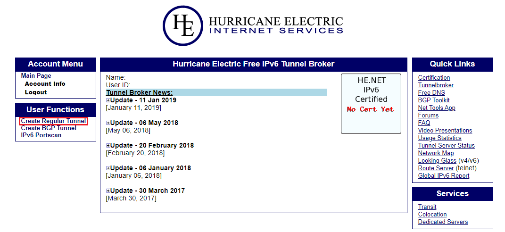

Some preparation before using Raspberry PI
==========================================

Some experience after testing for a long time.


Necessary Steps
---------------

### Step 1 change the password ###
```Bash
passwd # user:pi,oldpsw:raspberry
```

### Step 2 configure the ssh ###
```Bash
sudo nano /etc/ssh/ssh_config #set "GSSAPIAuthentication no"
sudo nano /etc/ssh/sshd_config #set "UseDNS no && Port 2101"
# generate & use publickey
ssh-keygen -t ed25519 -f raspberry -C 'for Raspberry Pi'
cat raspberry.pub >> ~/.ssh/authorized_keys
chmod 600 ~/.ssh/authorized_keys
sudo nano /etc/ssh/sshd_config
# PubkeyAuthentication yes
# AuthorizedKeysFile  .ssh/authorized_keys
# PasswordAuthentication no
# Then you should use the key "raspberry" to login, instead of password

# config google authenticator
sudo apt update && sudo apt install libpam-google-authenticator
google-authenticator
nano /etc/pam.d/sshd
# Add "auth required pam_google_authenticator.so" in a new line
nano /etc/ssh/sshd_config
# Change "# ChallengeResponseAuthentication no" to "ChallengeResponseAuthentication yes"

# All change would be applied after restarting sshd
sudo systemctl restart sshd

```

### Step 3 configure network ###
For old systems/Debian.  
```Bash
# sudo nano /etc/dhcpcd.conf
sudo echo 'interface eth0'>>/etc/dhcpcd.conf
sudo echo 'inform 192.168.31.101'>>/etc/dhcpcd.conf
sudo echo 'static routers=192.168.31.1'>>/etc/dhcpcd.conf
sudo echo 'static domain_name_servers=114.114.114.114 8.8.8.8'>>/etc/dhcpcd.conf
```
For ubuntu with netplan.  
Modify config file ```/etc/netplan/xxx.yaml```.  
```yaml
network:
    ethernets:
        enp1s0:
            dhcp4: no
            addresses: [192.168.31.101/24]
            gateway4: 192.168.31.1
            nameservers:
                addresses: [223.5.5.5,114.114.114.114,119.29.29.29,8.8.8.8,1.1.1.1]
    version: 2
```
then restart netplan:```sudo netplan apply```


### Step 4 Change apt source ###
Here I use [HIT](https://mirrors.hit.edu.cn/), and you can find proper mirror sites on [mirrorz](https://mirrorz.org/).  
```Bash
sudo nano /etc/apt/sources.list
sudo apt update
sudo apt upgrade
```

### Step 5 install necessary packages ###
```Bash
sudo apt install vim g++ git make cmake curl # rpi-update
# regularly update
sudo apt upgrade
# Raspberry Pi firmware update (!Please use proxy)
sudo rpi-update
```

### Step 6 ufw ###

The Uncomplicated Firewall (ufw) is a frontend for iptables and is particularly well-suited for host-based firewalls.
```Bash
sudo ufw allow 2101
sudo ufw enable
sudo init 6
```   
All settings are stored at ```/etc/ufw/``` and ```/etc/iptables.rules```.   


If you are using Debian 10(buster), the default iptables in nftables, which is no supported by ufw.  
You should use the following command to correct it(switch to the old version).  
```Bash
sudo update-alternatives --set iptables /usr/sbin/iptables-legacy
sudo update-alternatives --set ip6tables /usr/sbin/ip6tables-legacy
sudo update-alternatives --set arptables /usr/sbin/arptables-legacy
sudo update-alternatives --set ebtables /usr/sbin/ebtables-legacy
```

### Step 7 install ntfs support ###
Use source code:  
```Bash
sudo su
cd /usr/local/src
rm ntfs-3g_ntfsprogs-2017.3.23.tgz
wget https://tuxera.com/opensource/ntfs-3g_ntfsprogs-2017.3.23.tgz
tar zxf ntfs-3g_ntfsprogs-2017.3.23.tgz
cd ntfs-3g_ntfsprogs-2017.3.23
./configure && make && make install
exit

# sudo fdisk -l
# sudo mount -t ntfs-3g /dev/sdb1 /mnt/usb
```
For ubuntu users, you can also use ```apt``` to install it.
```Bash
sudo apt install ntfs-3g
```


### Step 8 Set timezone ###
```Bash
sudo dpkg-reconfigure tzdata # old method, works on new system, too
sudo timedatectl set–timezone Asia/Shanghai # new method
# don't use 'apt install ntp', instead, please use systemd-timesyncd, which is a light ntp client
sudo nano /etc/systemd/timesyncd.conf # edit ntp config
sudo timedatectl set-ntp true  # enable ntp
timedatectl status # show time
timedatectl timesync-status # show ntp sync state
```
[Arch Wiki](https://wiki.archlinux.org/index.php/systemd-timesyncd)


Helpful Parts
-------------

### Part 1 install openssl with sources code ###

*Not useful any more*  
```Bash
# sudo apt remove openssl
wget https://ftp.openssl.org/source/old/1.0.0/openssl-1.0.0.tar.gz
tar -zxvf openssl-1.0.0.tar.gz
cd openssl-1.0.0
sudo su
./config  --prefix=/usr/local --openssldir=/usr/local/ssl
make && make install_sw # (update)
./config shared --prefix=/usr/local --openssldir=/usr/local/ssl
make clean
make && make install_sw # (update)
exit
```

### Part 2 Transmission ###

#### with apt ####
**Attention!!!**  
Raspbian's apt- will install version 2.92,but it has a serious vulnerability.  
So, after you install it with apt, you should follow [Part 3](#part-3-install-transmission-with-sources-code)

```Bash
sudo apt update && sudo apt install transmission-daemon
```

#### from source code ####

Don't use this kind of way(unless you use raspbian)  
It is difficult to succeed.  

```Bash
sudo apt update && sudo apt install build-essential automake autoconf libtool pkg-config intltool libcurl4-openssl-dev libglib2.0-dev libevent-dev libminiupnpc-dev libgtk-3-dev libappindicator3-dev ca-certificates libcurl4-openssl-dev libssl-dev pkg-config build-essential checkinstall
wget https://raw.githubusercontent.com/transmission/transmission-releases/master/transmission-2.94.tar.xz # Don't use the wrong url
tar -xf transmission-2.94.tar.xz
cd transmission-2.94
./configure --prefix=/usr && make
sudo make install
```  
Then use [init.d](#initd) or [systemd](#systemd) to configure transmission service.  
By the way, the .config folder is at ```/var/lib/transmission-daemon```, or you can use ```sudo cat /etc/passwd``` to check the main folder of user debian-transmission(or transmission).  
And the settings.json is at ```/etc/transmission-daemon```

### Part 3 frp ###

Compile from source code.  
First of all, you need to [install Go](#part-14-install-go).  
If Windows xp support in needed, please use Go1.10.  
```Bash
GOROOT=/usr/local/go
GOPATH=/home/frp
PATH=$GOROOT/bin:$PATH:$HOME/bin
export GOROOT
export GOPATH
export PATH
git clone https://github.com/fatedier/frp.git $GOPATH/src/github.com/fatedier/frp
cd /home/frp/src/github.com/fatedier/frp/
go get github.com/docopt/docopt-go
go get github.com/fatedier/frp/models/config
go get github.com/vaughan0/go-ini
make
```

Install from binary release.
```Bash
wget https://github.com/fatedier/frp/releases/download/v0.26.0/frp_0.26.0_linux_arm.tar.gz
tar -zxvf frp_0.26.0_linux_arm.tar.gz
cd frp_0.26.0_linux_arm
sudo cp ./frps /usr/bin
sudo mkdir /etc/frps
# sudo cp ./frps.ini /etc/frps
cd ..
rm -rf frp_0.26.0_linux_arm
rm frp_0.26.0_linux_arm.tar.gz
cd /etc/frps
# then install service
```  
*Notice:frp cannot forward ftp, because ftp need a random port.*

### Part 4 configure ssl cert ###

use [let's encrypt](https://letsencrypt.org/)

#### The first way:  ####
Use acme.sh to set up *(take nginx for example)*  

```Bash
curl https://get.acme.sh | sh
alias acme.sh=~/.acme.sh/acme.sh
# sudo -- sh -c -e "echo '45 0 * * * sudo \"/home/pi/.acme.sh\"/acme.sh --cron --home \"/home/pi/.acme.sh\" > /dev/null' >> /var/spool/cron/crontabs/pi"
sudo mkdir /etc/nginx/ssl 
sudo chmod -R 777 /etc/nginx/ssl
# export DP_Id="XXXXXX"
# export DP_Key="XXXXXXXXXXXXX"
# use the api of DNSpod
DOMAIN="wangjihe.tk"
mkdir /etc/nginx/ssl/$DOMAIN
# acme.sh --issue --dns dns_dp -d $DOMAIN
# if you use cloudflare, recommand use API token (with Zone.DNS.edit)
export CF_Token="xxxxxxx"
# export CF_Account_ID="xxxxxxx"
# export CF_Zone_ID="xxxxxxx"
# or global api key
# CF_Email=XXX@XX.XX
# CF_Key=XXXXXXXXX
acme.sh --issue --dns dns_cf -d $DOMAIN
# Or standalone mode (need 80 opened && socat)
sudo setcap 'cap_net_bind_service=+ep' /usr/bin/socat # allow socat to bind the low ports
acme.sh --issue -d $DOMAIN --standalone
# Or use web server mode
WEBROOT="/var/www/html"
acme.sh --issue -d $DOMAIN -w $WEBROOT
# install
acme.sh --install-cert -d $DOMAIN \
--cert-file      /etc/nginx/ssl/$DOMAIN/ca.pem  \
--key-file       /etc/nginx/ssl/$DOMAIN/privkey.pem  \
--fullchain-file /etc/nginx/ssl/$DOMAIN/fullchain.pem \
--ca-file      /etc/nginx/ssl/$DOMAIN/chain.pem  \
--reloadcmd     "service nginx force-reload"
# acme.sh --renew -d example.com --force
# force refresh
acme.sh --upgrade --auto-upgrade # update automatically
```
then deploy nginx  


#### The second way:  ####
use certbot *(Not recommended)*  

```Bash
DOMAIN=wangjihe.tk
# if you use apache, replace -nginx with -apache
sudo certbot --manual --preferred-challenges dns certonly
sudo mkdir /etc/nginx/ssl 
sudo chmod -R 777 /etc/nginx/ssl
mkdir /etc/nginx/ssl/$DOMAIN
cp /etc/letsencrypt/live/$DOMAIN/fullchain.pem /etc/nginx/$DOMAIN/fullchain.pem 
cp /etc/letsencrypt/live/$DOMAIN/privkey.pem /etc/nginx/$DOMAIN/privkey.pem 
cp /etc/letsencrypt/live/$DOMAIN/chain.pem /etc/nginx/$DOMAIN/chain.pem 
# use DNS to get cert(it won't update automatically,and you need to change xxx.conf by yourself)
```
Or  
```Bash
sudo apt update && sudo apt install python-certbot-nginx
sudo sudo certbot --authenticator webroot --installer nginx # use exist web server
```  

Deploying Diffie-Hellman for TLS  

```Bash
openssl dhparam -out /etc/nginx/ssl/dhparams.pem 4096
# Then configure nginx
```  

more information:  
[Let's encrypt with DNS in TXT](https://blog.csdn.net/u012291393/article/details/78768547)  
[Transmission web interface with SSL](https://moeclub.org/2017/07/11/318)  
[SSLlabs](https://www.ssllabs.com/)  
[Deploying Diffie-Hellman for TLS](https://weakdh.org/sysadmin.html)  

### Part 5 nginx ###

Install:  
```sudo apt update && sudo apt install nginx nginx-extras```  

The [template](./nginx.conf.template) for /etc/nginx/conf.d/xxx.conf  

And if you set the option "auth_basic", remember to change the password  

```Bash
echo -n 'USERNAME:' >>/etc/nginx/password
openssl passwd PASSWORD >>/etc/nginx/password
# better not longer than 8
```

### Part 6 php ###

Install php-fpm only.(without mysql)  
```sudo apt update && sudo apt install php7.3-common php7.3-fpm php7.3-mbstring php7.3-bz2 php7.3-curl php7.3-bcmath```

Configure php.ini *(remember to use Ctrl+w to search)*  
```Bash
sudo nano /etc/php/7.3/fpm/php.ini
{
    session.use_strict_mode = 1
    session.cookie_secure = 1
    ; use https to transport cookies
    session.cookie_lifetime = 900
    session.cookie_httponly = 1
    session.cookie_samesite = "Strict"
    ; 15 minutes
    session.gc_probability = 1
}
```    

Enable php-fpm  
```Bash
sudo systemctl enable php7.3-fpm
sudo systemctl start php7.3-fpm
```

### Part 7 squid ###

squid is a powerful proxy.  

```Bash
sudo apt update && sudo apt install squid
sudo nano /etc/squid/squid.conf
```

Add these to the front of squid.conf  

```
http_port 7111
http_access allow all
acl localnet src 192.168.1.0/24
```

### Part 8 samba ###

If you install samba, NetBIOS will be enabled automatic.   
```Bash
sudo apt update && sudo apt install samba samba-common-bin
sudo pdbedit –a pi
sudo nano /etc/samba/smb.conf
sudo systemctl restart smbd
```
Template of [smb.conf](./smb.conf.template).  


### Part 9 DDNS ###

The project of NewFuture, [DDNS](https://github.com/NewFuture/DDNS) Support Cloudflare, Dnspod, Dns.com ...  
Use cron to run automatically:  
```Bash
crontab -e
{
    */5 * * * * /usr/bin/python "/home/pi/DDNS/run.py" -c "/home/pi/DDNS/cloudflare.json" >> "/home/pi/DDNS/cloudflare.log"
}
```

### Part 10 ups ###

If you have an ups of APC, you can install apcupsd to receive a power down signal.  

To see whether your ups is recognized:  
```Bash
lsusb
udevadm info --attribute-walk --name=/dev/usb/hiddev0 | egrep 'manufacturer|product|serial'
```  
To install apcupsd:  
```Bash
sudo apt update && sudo apt install apcupsd apcupsd-doc
sudo nano /etc/apcupsd/apcupsd.conf
```  
Which values you need to change(example for BK650-CH):  
  ```UPSNAME BK650-CH```:Any name you like, It's not important.  
  ```UPSCABLE usb```:The cable your ups uses.  
  ```UPSTYPE usb```:The type of your ups.  
  ```DEVICE ```:If you use usb type, you can leave it empty.  
  ```BATTERYLEVEL 15```:If during a power failure, the remaining battery percentage that apcupsd will initiate a system shutdown.  
  ```MINUTES 20```:After X minutes without wall power, system will be shutdown.  
  ```TIMEOUT 0```:After X seconds without wall power, system will be shutdown.(0 means disable this option)  
  ```KILLDELAY 0```:Shutdown will be delayed for X seconds.(0 means disable this option)  

Then:  
```Bash
sudo -- sh -c -e "sudo echo 'ISCONFIGURED=yes'>/etc/default/apcupsd"
sudo systemctl enable apcupsd
sudo systemctl start apcupsd
```

More information:  
[http://www.apcupsd.com/manual/manual.html](http://www.apcupsd.com/manual/manual.html)  
[https://wiki.archlinux.org/index.php/APC_UPS](https://wiki.archlinux.org/index.php/APC_UPS)  
*You can find the way to change the script that apcupsd will execute*  
[https://wiki.debian.org/apcupsd](https://wiki.debian.org/apcupsd)  

### Part 11 crypto++ ###

Install from source code.  

```Bash
cd /tmp
mkdir cryptopp7 && cd cryptopp7
wget https://www.cryptopp.com/cryptopp700.zip
unzip cryptopp700.zip
export CXXFLAGS="-DNDEBUG -g2 -O3 -std=c++11"
make && make test
sudo make install
cd ..
rm -rf cryptopp7
# g++ -std=c++11 file_name.cpp -o file_name -Wall -Wextra -Wparentheses -O2 -DNDEBUG -I/usr/include/cryptopp -lcryptopp -lpthread
```  
[Install](https://github.com/weidai11/cryptopp/blob/master/Install.txt)  
[Usage](https://www.cryptopp.com/docs/ref/)  

### Part 12 golang ###

Install from binary release. (can choose any version)  
```Bash
wget https://dl.google.com/go/go$VERSION.$OS-$ARCH.tar.gz # https://dl.google.com/go/go1.10.8.linux-amd64.tar.gz
sudo tar -C /usr/local -xzf go$VERSION.$OS-$ARCH.tar.gz
sudo -- sh -c -e 'sudo echo "export PATH=$PATH:/usr/local/go/bin">>/etc/profile'
```  
[Go main page](https://golang.org/)

### Part 13 byobu ###

Byobu is a GPLv3 open source text-based window manager and terminal multiplexer.  
It bases on tmux/screen.   
The main reason I use it is that I can return to a ssh session after abnormal disconnection.
```Bash
sudo apt update && sudo apt install byobu
byobu
byobu --help
```
[Byobu main page](https://byobu.org/)

### Part 14 IPv6 ###

It's for someone who only have IPv4 network.  

#### with teredo ####

You don't need to know what it is.  
But if you want, [teredo](https://en.wikipedia.org/wiki/Teredo_tunneling)  
```Bash
# Linux :
sudo apt update && sudo apt install miredo
ping6 ipv6.google.com
# Windows :
netsh interface teredo set state enterpriseclient server=default
ping -6 ipv6.test-ipv6.com
```

#### with tunnelbroker ####

If unfortunately, you are a "Internet" user in China, the first way may not fit you.  
First, you need an non-Chinese IP to register a tunnelbroker account. (Of cause if you already have one, you can login with Chinese IP)  
After logging in, click "Create Regular Tunnel".  

Then enter your internet IP into "IPv4 endpoint" and select a server.  
Next, turn to "Example Configurations" and select your operating system.
Remember to change "local","localaddress" or "source" to your local IP. (like 192.168.0.2)  
If you are lucky enough, you can enjoy your IPv6 tunnel.  

### Part 15 IPsec VPN ###

Use auto setup scripts from [hwdsl2](https://github.com/hwdsl2/setup-ipsec-vpn)  
```Bash
wget https://git.io/vpnsetup -O vpnsetup.sh && sudo sh vpnsetup.sh
sudo ufw allow 500 # ISAKMP
sudo ufw allow 4500 # ISAKMP NAT
sudo ufw allow 500 # Cisco IPsec
sudo systemctl restart ipsec
sudo systemctl restart xl2tpd
# check logs
grep pluto /var/log/auth.log
grep xl2tpd /var/log/syslog
# check status
sudo ipsec status
sudo ipsec verify
# list connected clients
ipsec whack --trafficstatus
# update libreswan
wget https://git.io/vpnupgrade -O vpnupgrade.sh && sudo sh vpnupgrade.sh
```  
[Server Setup](https://github.com/hwdsl2/setup-ipsec-vpn/blob/master/README.md)  
[Server Uninstall](https://github.com/hwdsl2/setup-ipsec-vpn/blob/master/docs/uninstall.md)  
[Client IPsec/XAuth](https://github.com/hwdsl2/setup-ipsec-vpn/blob/master/docs/clients-xauth.md)  
[Client IPsec/L2TP](https://github.com/hwdsl2/setup-ipsec-vpn/blob/master/docs/clients.md)  
[User Management](https://github.com/hwdsl2/setup-ipsec-vpn/blob/master/docs/manage-users.md)  

### Part 16 KMS Server ###

Use project [vlmcsd(KMS Emulator in C)](https://github.com/Wind4/vlmcsd).  
```Bash
cd /tmp
wget https://github.com/Wind4/vlmcsd/releases/download/svn1112/binaries.tar.gz -O vlmcsd.tar.gz
tar -zxvf vlmcsd.tar.gz
sudo cp binaries/Linux/arm/little-endian/glibc/vlmcsd-armv7el-glibc /usr/bin/vlmcsd
sudo chmod +x /usr/bin/vlmcsd
rm binaries -r
sudo nano /etc/systemd/system/vlmcsd.service
{
[Unit]
    Description=vlmcsd kms server
    After=network.target

[Service]
    Type=forking
    PIDFile=/run/vlmcsd.pid
    ExecStart=/usr/bin/vlmcsd -P 1688 -l /var/log/vlmcsd.log -p /run/vlmcsd.pid
    ExecStop=/bin/kill -HUP $MAINPID
    PrivateTmp=True
    Restart=always
    RestartSec=10

[Install]
    WantedBy=multi-user.target
}
sudo ufw allow 1688
```  

#### Windows Activation ####

Find your OS GVLK in [Windows GVLK list](./Windows_GVLKs.md) and run the command below:  
```Bash
slmgr.vbs -upk
slmgr.vbs -ipk 33PXH-7Y6KF-2VJC9-XBBR8-HVTHH
slmgr.vbs -skms ip.wangjihe.top
slmgr.vbs -ato
slmgr.vbs -dlv
```

#### Office Activation ####

Find your office GVLK in [Office GVLK list](./Office_GVLKs.md) and run the command below:  
```Bash
cd YOUR_OFFICE_DIR
cscript ospp.vbs /inpkey:OFFICE_GVLK
cscript ospp.vbs /sethst:KMS_HOST
cscript ospp.vbs /act
```

### Part 17 haporxy ###

A load balancer.  
But I use it to block plain http access ,requests as unknow domain or directly with ip.  
Need SNI support,so no working with ESNI.  
```
global
    log /dev/log    local0
    log /dev/log    local1 notice
    chroot /var/lib/haproxy
    stats socket /run/haproxy/admin.sock mode 660 level admin expose-fd listeners
    stats timeout 30s
    user haproxy
    group haproxy
    daemon

defaults
    timeout connect 10s
    timeout client  50s
    timeout server  20s

frontend web_server
    mode tcp
    bind :443                                               # listen port
    acl d1 req.ssl_sni -i domain1.example.com               # your domain 1
    acl d2 req.ssl_sni -i domain2.example.com               # your domain 2

    tcp-request inspect-delay 2s
    tcp-request content silent-drop if HTTP                 # drop all http request to 443
    tcp-request content silent-drop if !d1 !d2              # drop all sni not known
    tcp-request content accept if { req.ssl_hello_type 1 }  # accept ssl/tls connection
    default_backend https_server                            # forward traffic to backend(web server like nginx)

backend https_server
    mode tcp
    server serverhttps 127.0.0.1:37444                      # real web server
```

Use 'silent-drop' will prevent client from being notified, and on browser is ERR_TIMED_OUT, like this port is closed.  
If use 'reject', connection will be closed immediately, and on browser is ERR_EMPTY_RESPONSE or ERR_CONNECTION_CLOSED.  

[offical doc](https://cbonte.github.io/haproxy-dconv/)  
[http&https in one port](http://timjrobinson.com/haproxy-how-to-run-http-https-on-the-same-port/)  
[drop from unknown hosts](https://stackoverflow.com/questions/56501040/how-can-i-close-haproxy-frontend-connections-coming-from-unknown-hosts)  


### Part 18 Github ssh key && GPG key ###

```Bash
ssh-keygen -t ed25519 -C "github_email@xxx.com"
# then add public key to [github](https://github.com/settings/keys)
nano ~/.ssh/config
{
    Host github.com
        HostName github.com
        IdentityFile ~/.ssh/github_private_key
}
git config --global user.email "github_email@xxx.com"
git config --global user.name "account_name"
ssh -T git@github.com # test sshkey

export GPG_TTY=$(tty)
gpg2 --full-generate-key
gpg2 --list-secret-keys --keyid-format LONG
gpg --armor --export XXXXXXXXXXXXXXXX
# then add gpg public key to [github](https://github.com/settings/keys)
git config --global user.signingkey XXXXXXXXXXXXXXXX

git commit -S -m your_comment # -S ---> Sign
```

### Part 19 git ###
```Bash
git add -A # trace all files (respect .gitignore)
git config --global core.autocrlf true # use CRLF in checkout files, but replace to LF in commit
git status # show repository status
git reset HEAD . # revert add 
git remote set-url origin https_addr/ssh_addr # switch remote address
git checkout xxx # switch branch
git rm --cached -r XXX # delete file/dir on git only
```

### Part 20 systemd ###  
It's time to embrace the systemd.  

#### systemctl ####
Default config dir: /etc/systemd/system/ --> /usr/lib/systemd/system/  
```Bash
systemctl status # check status of all units
systemctl daemon-reload # reload systemd
systemctl list-unit-files # show a table listing all units, --type=
systemctl list-units # list all running units, --all, --failed, --type=, --state=
# for a specific unit
systemctl status/enable/disable/start/stop/restart/kill/show/cat/list-dependencies xxx
```

#### journalctl ####
Log manager. Default config file: /etc/systemd/journald.conf  
```Bash
sudo journalctl --vacuum-time=10years # set how long the log will be saved
sudo journalctl --vacuum-size=128G # set disk limitation
sudo journalctl --disk-usage # show disk usage
sudo journalctl -u x1 -u x2 # show log of units, -f [real time], --since "2020-01-01 00:00:00", -p err/debug, -k [kernel]
sudo journalctl -n 1000 # show last 1000 logs
```


#### others ####
```Bash
systemd-analyze # show boot time usage
systemd-analyze blame # of each unit
hostnamectl # show hostname, os, kernel version
sudo hostnamectl set-hostname xxx
localectl # show system language
sudo localectl set-locale LANG=en_GB.utf8
timedatectl # show tzdata
timedatectl list-timezones # list available time zones
sudo timedatectl set-timezone Asia/Shanghai
loginctl list-sessions # list logon sessions
loginctl list-users # list logon users
loginctl show-user xxx # show user info
```  


### Part 21 AppArmor ###
AppArmor is a Mandatory Access Control (MAC) system which is a kernel (LSM) enhancement to 
confine programs to a limited set of resources, like SELinux, but with some easy-to-use tools.  
```Bash
sudo apt install apparmor-profiles apparmor-utils # insttall AppArmor tools
sudo aa-unconfined # show all process with network access but without AppArmor profile
sudo aa-autodep xxx # generate profile for xxx according to ldd output.
sudo aa-logprof # analyze audit log to "learn" profile
sudo aa-complain xxx # switch xxx profile to "complain mode", which ALLOW everything except sth already denied in profile, but leave audit log,
sudo aa-enforce xxx # switch xxx profile to "enforce mode", which DENY everything, except sth allowed in profile.
sudo aa-disable xxx # disable AppArmor for xxx
```

#### Tips ####
Be careful of `CAP_*`, you should try to adjust the file permission instead of giving it to the program without thinking twice.  
`aa-logprof` still cannot handle everything for now, sometimes you need to adjust the profile manually.  
```Bash
# operation="file_mmap" info="Failed name lookup - disconnected path" error=-13
# If you see that in audit log, you need to add
flags=(attach_disconnected)
# to profile
```

[Building Profiles from the Command Line - SUSE](https://documentation.suse.com/en-us/sled/15-SP2/html/SLED-all/cha-apparmor-commandline.html)  
[F\*\*k AppArmor](https://presentations.nordisch.org/apparmor/#/)  
[Linux Capabilities](https://man7.org/linux/man-pages/man7/capabilities.7.html)  
[apparmor强制访问控制系统配置](https://blog.logc.icu/post/2021-04-08_18-09/)  
[在 Ubuntu 上配置 AppArmor 实现强制访问控制（MAC）](https://www.mf8.biz/ubuntu-apparmor-openresty/)  
[AppArmor 'Failed name lookup - disconnected path'](https://bugs.launchpad.net/apparmor/+bug/1578529)  


### Part 22 mount raw disk ###

```Bash
# map raw disk image to loop device
losetup /dev/loop0 raw-image-file.raw
# use kpartx to identify and map disk partitions
kpartx -a /dev/loop0
# now, you can see partitions under /dev/mapper/loop0*
ls /dev/mapper/loop0*
# and mount normally
mount /dev/mapper/loop0p1 /mnt
# ummap everything
umount /mnt
kpartx -d /dev/loop0
losetup -d /dev/loop0
```  


Create Services.
------

### init.d ###

Use init.d to manage service.  
You need to change the value of `dir`,`cmd`and`user`.  
To see the template please click [here](./initd.template)  
```Bash
sudo cp template_for_initd /etc/init.d/YOUR_SERVICE
sudo chmod 775 /etc/init.d/YOUR_SERVICE
sudo /etc/init.d/YOUR_SERVICE start # (stop|status|restart)
```
### systemd ###

Use systemd to manage service.
You need to change the value of `Description`,`User`,`Group`(*the same as User*),`WorkingDirectory`,`ExecStart`and`ExecStop`.
*Notice:The space in WorkingDirectory should be replaced by \x20*
To see the template please click [here](./systemd.service.template)  
```Bash
sudo cp template_for_systemd /etc/systemd/system/YOUR_SERVICE.service
sudo systemctl daemon-reload
sudo systemctl enable YOUR_SERVICE # start automatic
sudo systemctl start YOUR_SERVICE # (stop|restart|disable)
```
### WinSW ###

Use WinSW to install service on Windows.  
Please install .Net 4.  
[Here](https://github.com/kohsuke/winsw) has detailed information.  
An [example](./WinSW.xml.template) for frpc.  
*Notice: if you see the error"WMI Operation failure: AccessDenied",Please check if you have used cipher to encrypt your files.*

Others
------  
### Compression ###

```Bash
tar -zxvf *.tar.gz # unzip
tar -xf *.tar.xz # unzip
tar -cvf /tmp/etc.tar /etc # Only bale, not compress
tar -czvf /tmp/etc.tar.gz /etc # compress with gzip
tar -cjvf /tmp/etc.tar.bz2 /etc # compress with bzip2
```

### Other tricks ###

```Bash
cat /sys/class/thermal/thermal_zone0/temp # check the temperature of CPU
git -C /home/wangjihe/raspIP/ # set the location of git repositories
top -u pi # like taskmgr
htop # an excellent taaskmgr
du -h -d1 [folder] # calculate folder size
sdiff -abls a.new a.old # compare files
w # list pts sessions
# kill backgroud pts
pkill -HUP -t pts/0
pkill -9 -t pts/0
# set proxy
export http_proxy=socks5://127.0.0.1:1926
export https_proxy=socks5://127.0.0.1:1926
# Sublime text 3 ,Preferences -> Settings-Syntax Specific -> "default_line_endings":"unix"
cp -rl(s) src dst # use hard(soft) link instead of copy
find . -type f -name "*.log" -print0 | xargs -0 rm -f
sed -i 's/origin/dst/g' *.xxx # replace string in file
cat /dev/null > ~/.bash_history && history -c && exit # entirely clear bash history
lsb_release -a # show os info
cat /etc/os-release # show os info
# xdelta3 gen patch
xdelta3 -v -e -s origin_file patched_file patch
# xdelta3 apply patch, use -f to overwrite patched_file
xdelta3 -v -d -s origin_file patch patched_file
```

### Network "top" ###

Both ```iftop``` and ```nethogs``` are useful.  
You can simply use ```apt``` to install them.  

### mount automatically at boot ###  

First, you need to find out the UUID of your hard disk.
```Bash
ls -l /dev/disk/by-uuid
``` 
Then modify ```/etc/fstab```, an example:  
```Bash
UUID=240EB1E10EB1ABE4 /mnt/HDD1 ntfs-3g defaults,exec,umask=0000 0 0
```    
You can check the fstab file with command ```sudo findmnt --verify --verbose```  
To know more information, please look at [here](https://wiki.archlinux.org/index.php/Fstab).

**Warning:  
If you enter an wrong UUID(not exist or not connected), system boot will fail!  
Just like this:**  
> You are in emergency mode. After logging in, type...  
> Cannot open access to console, the root account is locked.

### use openssl to build an own CA ###  
```Bash
mkdir certdir
cd certdir
# 签发根证书
openssl req -new -x509 -days 3650 -keyout CARoot.key -out CARoot.crt 
openssl rsa -in CARoot.key -out CARoot.key
# 签发二级证书,注意将/usr/lib/ssl/openssl.cnf中的stateOrProvinceName,organizationName设置为optional
mkdir demoCA
mkdir demoCA/newcerts
touch demoCA/index.txt
echo '01'>demoCA/serial
openssl genrsa -out roota.key 4096
openssl req -new -key roota.key -out roota.csr
openssl ca -extensions v3_ca -in roota.csr -out roota.crt -cert CARoot.crt -keyfile CARoot.key -days 1826 -policy policy_anything
cat roota.crt CARoot.crt | tee roota_fullchain.crt
# 签发SSL证书
openssl genrsa -out server.key 4096
# openssl ecparam -name secp256k1 -genkey -out server.key 4096
openssl req -new -key server.key -out server.csr -sha256 -days 3650 -reqexts SAN -config <(cat /usr/lib/ssl/openssl.cnf <(printf '[SAN]\nsubjectAltName=DNS:www.baidu.com,IP:192.168.1.1'))
openssl ca -in server.csr -cert roota.crt -keyfile roota.key -out server.crt -md sha256 -extensions SAN -config <(cat /usr/lib/ssl/openssl.cnf <(printf '[SAN]\nsubjectAltName=DNS:www.baidu.com,IP:192.168.1.1'))
cat server.crt roota.crt CARoot.crt | tee server_fullchain.crt
# 导出合并为p12格式
openssl pkcs12 -export -in server.crt -inkey server.key -name "FriendlyName" -chain -CAfile roota_fullchain.crt -out server.pfx
# 吊销证书
openssl ca -revoke server.crt -cert roota.crt -keyfile roota.key
# 所有证书countryName都应相同

# debian安装证书
sudo cp CARoot.crt /usr/local/share/ca-certificates/
sudo update-ca-certificates
# debian移除证书
sudo rm /usr/local/share/ca-certificates/CARoot.crt
sudo update-ca-certificates --fresh
```