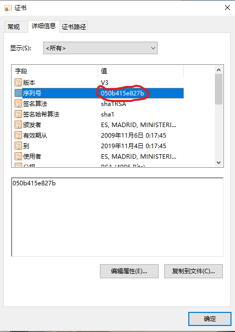

### Windows Certificate Manager ###
`Win+R`,enter `certmgr.msc`  

### Install a Certificate on Windows ###  
Command line:`certutil -addstore "ROOT" CARoot.crt`  
After installed, if you want to set other extra properties, you need to write the inf file first.
```inf
[Version]
    Signature = "$Windows NT$"
[Properties]
     11 = "{text}Friendly Name" ; Add friendly name property

     2 = "{text}" ; Add Key Provider Information property
       _continue_ = "Container=Container Name&"
       _continue_ = "Provider=Microsoft Strong Cryptographic Provider&"
       _continue_ = "ProviderType=1&"
       _continue_ = "Flags=0&"
       _continue_ = "KeySpec=2"

     9 = "{text}" ; Add Enhanced Key Usage property
       _continue_ = "1.3.6.1.5.5.7.3.2,"
       _continue_ = "1.3.6.1.5.5.7.3.1,"
```  
At the "Enhanced Key Usage property", you need to enter the OID instead of the name of property, youcan find them [here](./OID.txt).  
Then, use command ```certutil -repairstore ROOT "{SerialNumber}" install.inf```.  
You can find the serial number by this
